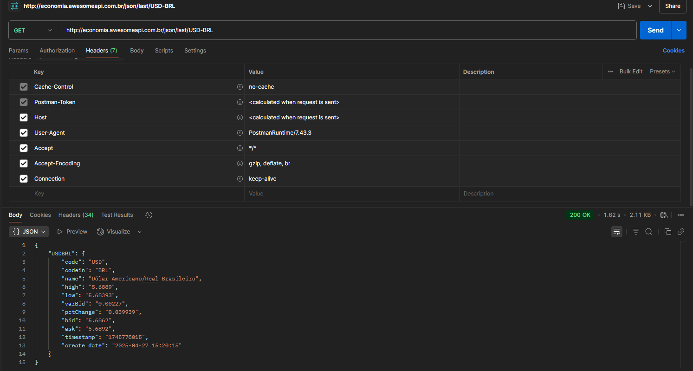

## 🎓 Projeto para a Faculdade

Este projeto foi desenvolvido como parte da disciplina **Programação Web** do curso de **Análise e Desenvolvimento de Sistemas** na **FATEC Taquaritinga**.

O objetivo deste trabalho é consumir uma API utilizando o método **GET** e exibir as informações de forma organizada e acessível para o usuário em uma página web.

Fomos designados para trabalhar com a API AwesomeAPI (moedas) e optamos por desenvolver um conversor de moedas simples para demonstrar o uso da API.

## Requisitos

O projeto foi feito usando Laravel, portanto, para conseguir executar basta seguir alguns passos.

```bash
 git clone git@github.com:thomasdemauri/api-currency.git
 composer install
 php artisan key:generate
```

## Print do Postman


## 👥 Integrantes
- **Gustavo Rodrigues**
- **Rafael Costa**
- **Thomas Mauro**